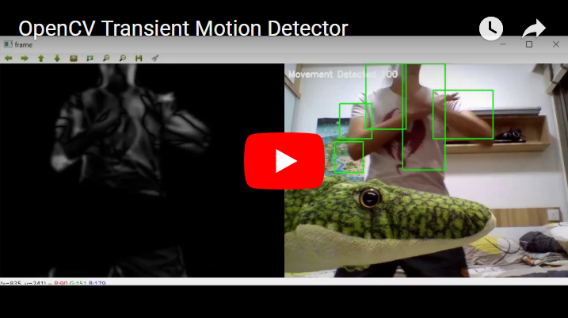

# opencv-motion-detector
Detects transient motion in a video feed. If said motion is large enough, and recent enough, reports that there is motion! 

The motion detected state is then held for some user specified amount of time even when no motion is detected until finally the program declares that no motion is detected.

## **Dependencies**

- OpenCV 2
- Image Utilities (imutils)

## Working Theory

OpenCV is used to calculate absolute frame deltas against the most recent saved frame and the current frame. The frame deltas are then passed through a threshold filter, and bounding boxes are drawn around contours of the thresholded frame. (The frequency of saving frames is determined via the user parameter.)

A sufficiently large bounding box derived from the contours of a thresholded frame delta image is considered movement.

## **User Configurable Parameters**

Just change these few parameters located near the top of the Python script

- **FRAMES_TO_PERSIST**
  -  Number of frames to pass before changing the frame to compare the current frame against.
- **MIN_SIZE_FOR_MOVEMENT**
  - Minimum boxed area for a detected motion to count as actual motion. Use it to filter out noise or small objects.
- **MOVEMENT_DETECTED_PERSISTENCE**
  - Minimum length of time where no motion is detected it should take (in program cycles) for the program to declare that there is no movement.